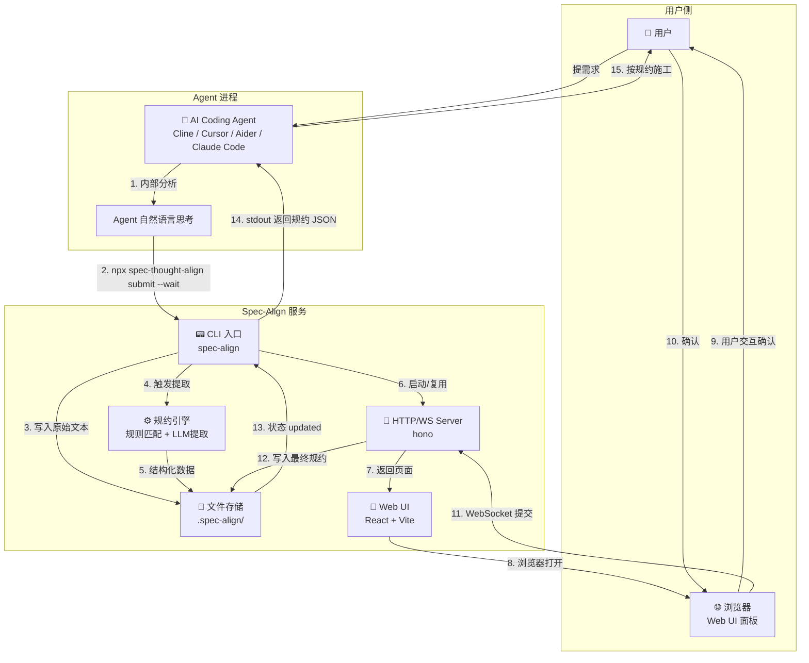
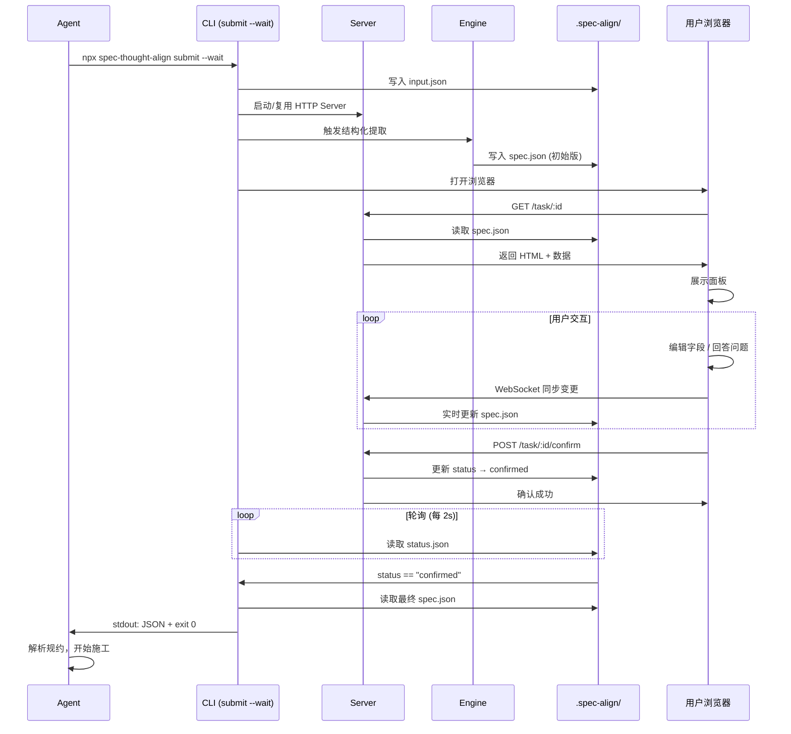
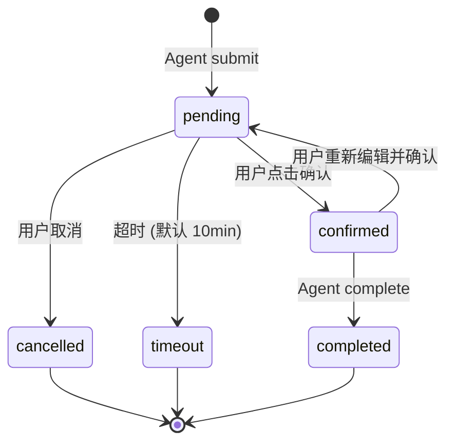
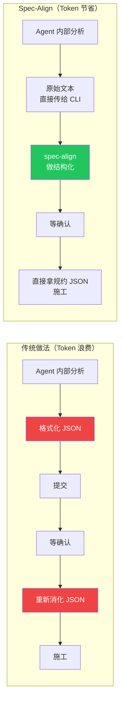

# Spec-Align 架构图

## 整体架构

```mermaid
graph TB
    subgraph "用户侧"
        USER[👤 用户]
        BROWSER[🌐 浏览器<br/>Web UI 面板]
    end

    subgraph "Agent 进程"
        AGENT[🤖 AI Coding Agent<br/>Cline / Cursor / Aider / Claude Code]
        ANALYSIS[Agent 自然语言思考]
    end

    subgraph "Spec-Align 服务"
        CLI[📟 CLI 入口<br/>spec-align]
        SERVER[🔌 HTTP/WS Server<br/>hono]
        ENGINE[⚙️ 规约引擎<br/>规则匹配 + LLM提取]
        STORAGE[📁 文件存储<br/>.spec-align/]
        WEBUI[🎨 Web UI<br/>React + Vite]
    end

    USER -->|"提需求"| AGENT
    AGENT -->|"1. 内部分析"| ANALYSIS
    ANALYSIS -->|"2. npx spec-thought-align submit --wait"| CLI
    CLI -->|"3. 写入原始文本"| STORAGE
    CLI -->|"4. 触发提取"| ENGINE
    ENGINE -->|"5. 结构化数据"| STORAGE
    CLI -->|"6. 启动/复用"| SERVER
    SERVER -->|"7. 返回页面"| WEBUI
    WEBUI -->|"8. 浏览器打开"| BROWSER
    BROWSER -->|"9. 用户交互确认"| USER
    USER -->|"10. 确认"| BROWSER
    BROWSER -->|"11. WebSocket 提交"| SERVER
    SERVER -->|"12. 写入最终规约"| STORAGE
    STORAGE -->|"13. 状态 updated"| CLI
    CLI -->|"14. stdout 返回规约 JSON"| AGENT
    AGENT -->|"15. 按规约施工"| USER
```

## CLI 命令流程

```mermaid
sequenceDiagram
    participant A as Agent
    participant C as CLI (submit --wait)
    participant S as Server
    participant E as Engine
    participant F as .spec-align/
    participant U as 用户浏览器

    A->>C: npx spec-thought-align submit --wait
    C->>F: 写入 input.json
    C->>S: 启动/复用 HTTP Server
    C->>E: 触发结构化提取
    E->>F: 写入 spec.json (初始版)
    C->>U: 打开浏览器
    U->>S: GET /task/:id
    S->>F: 读取 spec.json
    S->>U: 返回 HTML + 数据
    U->>U: 展示面板

    loop 用户交互
        U->>U: 编辑字段 / 回答问题
        U->>S: WebSocket 同步变更
        S->>F: 实时更新 spec.json
    end

    U->>S: POST /task/:id/confirm
    S->>F: 更新 status → confirmed
    S->>U: 确认成功

    loop 轮询 (每 2s)
        C->>F: 读取 status.json
    end

    F->>C: status == "confirmed"
    C->>F: 读取最终 spec.json
    C->>A: stdout: JSON + exit 0
    A->>A: 解析规约，开始施工
```

## 状态机

```mermaid
stateDiagram-v2
    [*] --> pending: Agent submit
    pending --> confirmed: 用户点击确认
    pending --> cancelled: 用户取消
    pending --> timeout: 超时 (默认 10min)
    confirmed --> completed: Agent complete
    confirmed --> pending: 用户重新编辑并确认
    cancelled --> [*]
    timeout --> [*]
    completed --> [*]
```

## Token 流对比

```mermaid
graph LR
    subgraph "传统做法（Token 浪费）"
        T1[Agent 内部分析] --> T2[格式化 JSON] --> T3[提交] --> T4[等确认] --> T5[重新消化 JSON] --> T6[施工]
    end

    subgraph "Spec-Align（Token 节省）"
        S1[Agent 内部分析] --> S2[原始文本<br/>直接传给 CLI] --> S3[spec-align<br/>做结构化] --> S4[等确认] --> S5[直接拿规约 JSON<br/>施工]
    end

    style T2 fill:#EF4444,color:white
    style T5 fill:#EF4444,color:white
    style S3 fill:#22C55E,color:white
```

- 🔴 红色：额外 token 消耗
- 🟢 绿色：spec-align 侧处理（用便宜模型或纯规则）
